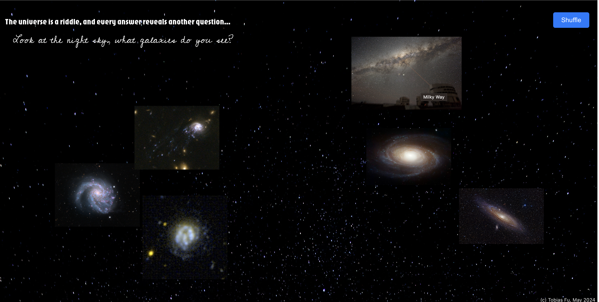

# Galaxy Explorer





## Introduction

Galaxy Explorer is an interactive web application designed to help users learn about and explore some of the most fascinating galaxies in the universe. The app features a selection of 14 unique galaxies, providing detailed information about each one. Users can view six galaxies at a time, displayed randomly. There is a shuffle button that allows users to reload the page and see a new random set of galaxies.

## Features

- **Interactive UI**: A user-friendly interface that makes learning about galaxies engaging.
- **Random Display**: Each session starts with five randomly selected galaxies from our curated list.
- **Shuffle Functionality**: Users can press the "Shuffle" button to randomly display a different set of galaxies, enhancing the exploration experience.

## Technologies Used

- HTML/CSS
- JavaScript
- React.js

## Setup

To get a local copy up and running, follow these simple steps.

1. Clone the repo
   ```sh
   git clone https://github.com/your-username/galaxy-explorer.git

2. Navigate to the project directory
   ```sh
    cd galaxy-explorer

3. Install dependencies
   ```sh
    npm install

4. Run the project locally
    ```sh
    npm start

